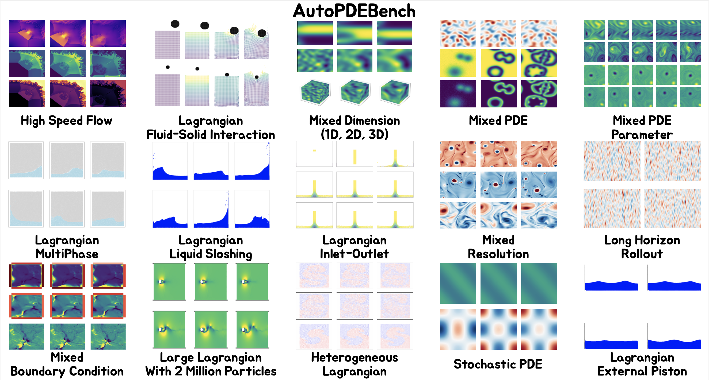

# AutoPDEBench: Benchmarking LLM Auto-Research for Neural PDE Solver Design



## Setup

### 1. Create environment

```bash
conda create -n autopdebench python=3.9.20
conda activate autopdebench
pip install -r requirements.txt
```

### 2. Configure LLM API keys

Export the API key(s) for whichever provider(s) you plan to use:

```bash
export OPENAI_API_KEY="your-openai-key"
export ANTHROPIC_API_KEY="your-claude-key"
export GEMINI_API_KEY="your-gemini-key"
export QWEN_API_KEY="your-qwen-key"
export KIMI_API_KEY="your-kimi-key"
export DEEPSEEK_API_KEY="your-deepseek-key"
export GROK_API_KEY="your-grok-key"
```

### 3. Download the data

Download the dataset, then specify the paths in the config:

```yaml
dataset_root:        # where dataset is
data_save_path:      # where to save dataset loading cache
```

### 4. Run the agent

```bash
cd 1_HighSpeedFlow/agent
bash run_agent.sh
```

## Dataset Links

| Dataset | Description | Source | Link |
|---|---|---|---|
| HighSpeedFlow | Supersonic flows that exceed the speed of sound and create sudden changes such as shock waves. | Public | [Download](https://huggingface.co/datasets/divelab/ShockCast) |
| RealData | Real-world data consisting of noisy measurements collected using time-resolved PIV. | Public | [Download](https://huggingface.co/datasets/AI4Science-WestlakeU/RealPDEBench) |
| MixedParam | Mixed PDE parameters, where the governing coefficients vary across trajectories. | Ours | [Download](https://huggingface.co/datasets/AnonymousRandom/MixedParam) |
| Heterogeneous | Lagrangian particle datasets with particles possessing distinct physical attributes such as density. | Ours | [Download](https://huggingface.co/datasets/AnonymousRandom/Heterogeneous) |
| Partial | Partially observed initial conditions that require predicting the full trajectory. | Ours | [Download](https://huggingface.co/datasets/AnonymousRandom/Partial) |
| MixedDomain | Grid, mesh, and particle representations of the same underlying physical system. | Ours | [Download](https://huggingface.co/datasets/AnonymousRandom/MixedDomain) |
| MultiPhysics | Multiphysics simulations that capture the interactions between multiple physical processes. | Public | [Download](https://drive.google.com/file/d/1W30JZzzwsLFyIkWfHKRJeYA_e5JG91zD/view) |
| 3D | Spatiotemporal datasets featuring three-dimensional volumetric observations. | Public | [Download](https://polymathic-ai.org/the_well/) |
| IrregularTime | Observations recorded at non-uniform time intervals. | Ours | [Download](https://huggingface.co/datasets/AnonymousRandom/IrregularTime) |
| LagInletOutlet | Lagrangian inlet-outlet data lacking 1-to-1 particle correspondence. | Ours | [Download](https://huggingface.co/datasets/AnonymousRandom/LagDynamic) |
| LagFSI | Lagrangian fluid-solid interaction datasets where both phases are represented by Lagrangian particles. | Ours | [Download](https://huggingface.co/datasets/AnonymousRandom/LagFSI) |
| Extreme | Extreme scale capturing 3D supernova blastwaves across seven orders of magnitude. | Public | [Download](https://polymathic-ai.org/the_well/) |
| MixedRes | Generalization datasets that capture PDE dynamics on diverse domains and resolutions. | Ours | [Download](https://huggingface.co/datasets/AnonymousRandom/MixedRes) |
| ExtLag1 | Lagrangian particle datasets with liquid sloshing as external force. | Ours | [Download](https://huggingface.co/datasets/AnonymousRandom/ExtLag1) |
| ExtLag2 | Lagrangian fluid dynamics driven by the external force of a moving piston. | Ours | [Download](https://huggingface.co/datasets/AnonymousRandom/ExtLag2) |
| MixedDim | Identical PDE dynamics in 1D, 2D, and 3D. | Ours | [Download](https://huggingface.co/datasets/AnonymousRandom/MixedDim) |
| MixedBC | Identical PDE under Dirichlet, Neumann, and periodic boundary conditions. | Ours | [Download](https://huggingface.co/datasets/AnonymousRandom/MixedBC) |
| LongHorizon | Extremely long-horizon, 5,000-step rollouts. | Ours | [Download](https://huggingface.co/datasets/AnonymousRandom/LongHorizon) |
| Stochastic | Stochastic PDE dataset. | Ours | [Download](https://huggingface.co/AnonymousRandom/Stochastic) |
| MultiPhase | Lagrangian particle datasets modeling multiphase liquid-gas interactions. | Ours | [Download](https://huggingface.co/datasets/AnonymousRandom/MultiPhase) |
| MixedPDE | A diverse range of PDEs. | Ours | [Download](https://huggingface.co/datasets/AnonymousRandom/MixedPDE) |
| LargeLag | Large-scale, high-resolution Lagrangian dataset featuring millions of particles. | Ours | [Download](https://huggingface.co/datasets/AnonymousRandom/LargeLag) |
| Sim2Real | Datasets designed for sim-to-real transfer. | Public | [Download](https://huggingface.co/datasets/AI4Science-WestlakeU/RealPDEBench) |
| HighDimensional | 5D gyrokinetic dataset capturing high-dimensional PDE dynamics. | Ours | [Download](https://huggingface.co/datasets/AnonymousRandom/HighDimensional) |
| ComplexGeometry | Flow around complex geometries. | Public | [Download](http://www.nobuyuki-umetani.com/publication/mlcfd_data.zip) |

## Citation

If you are interested in our work, please consider citing:

```bibtex

```
